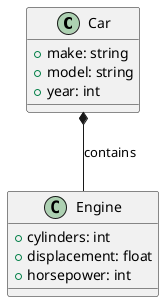
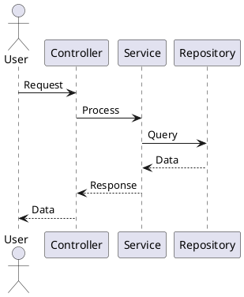
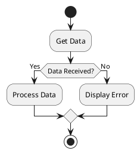
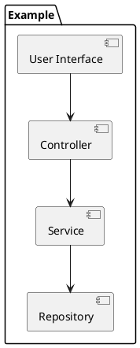
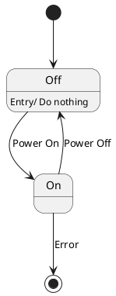
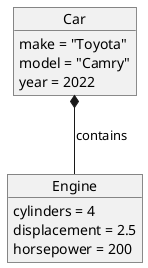
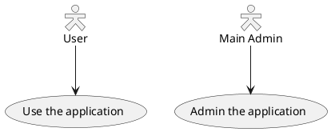

こんにちは！ROOXIM株式会社COO上原です。
今回は、投稿内でUMLを使えるようにしようと思います。
具体的にはPlantUMLでクラス図や、シーケンス図といったダイアグラムを使えるようにします。
<!-- more -->

# PlantUMLとは
PlantUMLは、テキストベースのモデリングツールで、UML（Unified Modeling Language）図を生成するためのオープンソースのツールです。
PlantUMLを使用すると、テキストで UML 図を記述し、自動的にグラフィカルな図に変換することができます。
PlantUMLは以下のようなUML図をサポートしています。

1. クラス図
2. シーケンス図
3. アクティビティ図
4. コンポーネント図
5. ステートマシン図
6. オブジェクト図
7. ユースケース図

## plantumlの出力例
このブログでは実際にPlantuml記法が使えるようになっています。
実際の出力例を示します。

### クラス図
```text
@startuml
class Car {
  + make: string
  + model: string
  + year: int
}

class Engine {
  + cylinders: int
  + displacement: float
  + horsepower: int
}

Car *-- Engine : contains

@enduml
```

#### 実際の出力


### シーケンス図
```text
@startuml
actor User
participant "Controller" as Controller
participant "Service" as Service
participant "Repository" as Repository

User -> Controller: Request
Controller -> Service: Process
Service -> Repository: Query
Repository --> Service: Data
Service --> Controller: Response
Controller --> User: Data
@enduml
```
#### 実際の出力


### アクティビティ図
```text
@startuml
start
:Get Data;
if (Data Received?) then (Yes)
  :Process Data;
else (No)
  :Display Error;
endif
stop
@enduml
```
#### 実際の出力

### コンポーネント図
```text
@startuml
package "Example" {
  [User Interface] --> [Controller]
  [Controller] --> [Service]
  [Service] --> [Repository]
}
@enduml
```
#### 実際の出力

### ステートマシン図
```text
@startuml
[*] --> Off

Off : Entry/ Do nothing
Off --> On : Power On

On --> Off : Power Off
On --> [*] : Error
@enduml
```
#### 実際の出力

### オブジェクト図
```text
@startuml
object Car {
  make = "Toyota"
  model = "Camry"
  year = 2022
}

object Engine {
  cylinders = 4
  displacement = 2.5
  horsepower = 200
}

Car *-- Engine : contains
@enduml
```
#### 実際の出力

### ユースケース図
```text
@startuml
skinparam actorStyle Hollow 
:User: --> (Use)
"Main Admin" as Admin
"Use the application" as (Use)
Admin --> (Admin the application)
@enduml
```
#### 実際の出力


# Hexoでplantumlを設定
では実際にHexoにPlantumlを設定していきましょう。

## hexo-filter-plantumlをインストール
以下のコマンドで`hexo-filter-plantuml`をインストールします。
```bash
npm install hexo-filter-plantuml --save
```

## `hexo-filter-plantuml`プラグインの設定
`_config.yml`を編集して`hexo-filter-plantuml`プラグインの設定をします。
以下の設定をファイルの最後に追加します。
```yaml _config.yml
plantuml:
  #  Local or PlantUMLServer.
  render: "PlantUMLServer"

  # The render server, you can also create your self-hosting sever
  # self-hosting cmd: java -jar /usr/local/Cellar/plantuml/1.2021.5/libexec/plantuml.jar -picoweb
  # server: http://localhost:8080/plantuml
  server: "http://www.plantuml.com/plantuml"
  # "inline": <svg>xxx<svg/>
  # "inlineUrlEncode": 
  # "inlineBase64": 
  # "localLink": 
  # "externalLink": 
  link: "inline"

  # common options: svg/png
  outputFormat: "svg"

  # class-name for element style. The default style is center-aligned block
  className: "plantuml"
```

## 記事にplantumlを追加

## サーバを再起動する
プラグインインストール後は以下のコマンドでHexoサーバを再起動します。
```bash
hexo clean
hexo s
```

## ブラウザで確認
ブラウザで `http://localhost:4000` にアクセスして編集した記事にUMLが画像として表示されていることを確認します。
実際に表示されていれば完了です。

# 最後に
技術ブログということもありUMLを使うことは多いと思います。
そこで使うかわからないですがとりあえず設定しておきました。
plantumlは弊社業務でもかなり使うのでガッツリ使っていきたいですね!


