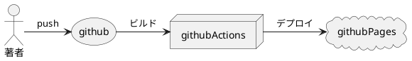

こんにちは！ROOXIM株式会社COO 上原です。
今回は、HexoをGithubPagesでホスティングしていこうと思います。

<!-- more -->

# どうなるの?
GithubにHexoのプロジェクトをPushするとGithubActionsが動いてGithubPagesにブログが公開されるようになります。


# 設定方法
ここではgithubActionsの設定とGithub Actionsの設定をご紹介しようと思います。
## Githubのリポジトリの設定
まずは、GithubPagesのソースをGithub Actionsにしましょう。

Githubのリポジトリのページを開いて`Settings`を選択しましょう。


設定画面を開いたら、左のメニューから`Pages`を選択して、`Build and Deployment`の`Source`を`Github Actions`に設定しましょう。


## Github Actionsの設定
プロジェクトに`.github/workflows/pages.yml`ファイルを追加します。
内容は以下をそのまま記載します。(nodeのバージョンは18を利用しています。)
```yaml .github/workflows/pages.yml
name: Pages

on:
  push:
    branches:
      - main  # default branch

jobs:
  build:
    runs-on: ubuntu-latest
    steps:
      - uses: actions/checkout@v3
        with:
          token: ${{ secrets.GITHUB_TOKEN }}
          # If your repository depends on submodule, please see: https://github.com/actions/checkout
          submodules: recursive
      - name: Use Node.js 16.x
        uses: actions/setup-node@v2
        with:
          node-version: '18'
      - name: Cache NPM dependencies
        uses: actions/cache@v2
        with:
          path: node_modules
          key: ${{ runner.OS }}-npm-cache
          restore-keys: |
            ${{ runner.OS }}-npm-cache
      - name: Install Dependencies
        run: npm install
      - name: Build
        run: npm run build
      - name: Upload Pages artifact
        uses: actions/upload-pages-artifact@v2
        with:
          path: ./public
  deploy:
    needs: build
    permissions:
      pages: write
      id-token: write
    environment:
      name: github-pages
      url: ${{ steps.deployment.outputs.page_url }}
    runs-on: ubuntu-latest
    steps:
      - name: Deploy to GitHub Pages
        id: deployment
        uses: actions/deploy-pages@v2

```

## mainブランチにPush
変更をコミットしてPushしましょう。

## 公開されているか確認
カスタムドメインを設定していない場合、https://<githubのusername>.github.io/<repository名>で公開されています。
ブラウザでアクセスして公開されているか、確認しましょう。

# 最後に
以上でGithub pagesでサイトを公開出来ました。
あとはカスタムドメイン化したりなどで更に独自のページにしていくと良いでしょう。
